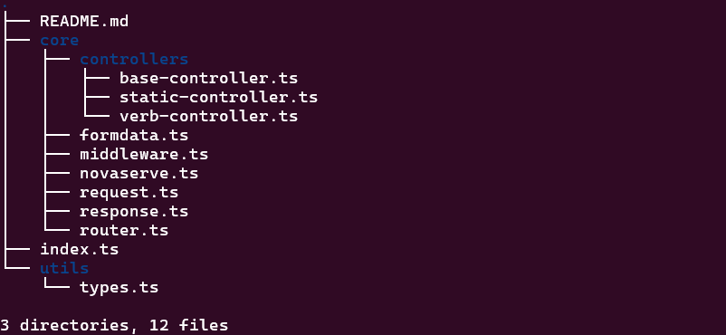

# Code Directory

This directory contains the source code for the library.

## File Structure



## Code Documentation

All the code files have detailed comments about the class code in each file.

## Source Files

### Request File

Contains code for the custom request class.
[Request](./core/request.ts)

### FormData File

Contains code for the custom class used to parse FormData.
[FormData](./core/formdata.ts)

### Response File

Contains code for the custom response class.
[Response](./core/response.ts)

### Middleware File

Contains code for the middleware class.
[Middleware](./core/middleware.ts)

### Router File

Contains code for the router class.
[Middleware](./core/router.ts)

### Controller Files

#### Base Controller

Contains code for the base controller **all other controllers extend**.
[BaseController](./core/controllers/base-controller.ts)

#### Verb Controller

Contains code for the verb controller that handles different types of request methods **(HTTP Verbs)**.
[BaseController](./core/controllers/verb-controller.ts)

#### Static Controller

Contains code for the static controller that handles serving static files like images or html relative to the CWD of the server.
Static files should be stored in

```bash
CWD/public
```

[StaticController](./core/controllers/static-controller.ts)
